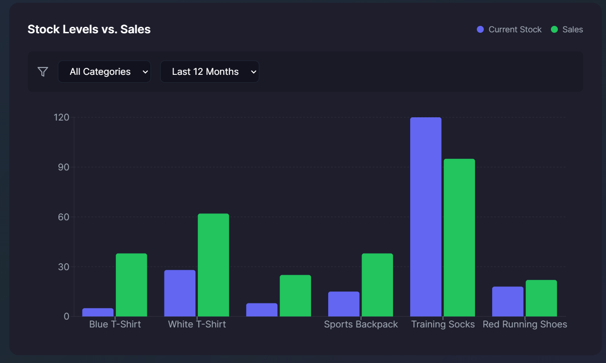

# StockPilot AI 🚀

StockPilot AI is an intelligent inventory management and analytics platform that helps e-commerce businesses optimize their stock levels and make data-driven decisions using artificial intelligence.


<p align="center"><i>Dashboard Preview</i></p>

## Tech Stack 🛠️

### Frontend
- **React** (v18) with TypeScript
- **Vite** for build tooling
- **TailwindCSS** for styling
- **Material UI** and **Heroicons** for UI components
- **React Router** for client-side routing
- **React Query** for data fetching and caching
- **Chart.js** and **Recharts** for data visualization

### Backend & Services
- **Firebase**
  - Authentication
  - Firestore database
  - Cloud Functions
- **Shopify Integration**
  - Full API integration for product and order management
  - Real-time sync with your Shopify store
- **Stripe**
  - Subscription management
  - Payment processing
- **OpenAI**
  - AI-powered inventory recommendations
  - Smart restocking suggestions
  - Sales trend analysis

## Core Features 🌟

### Dashboard
The main dashboard (`DashboardGrid.tsx`) provides a comprehensive view of your store's performance with several key components:

1. **Product Sales & Stock Chart**
   - Visual representation of sales trends
   - Real-time inventory levels
   - Historical data analysis

2. **Inventory Alerts**
   - Low stock warnings
   - Restock recommendations
   - Overstocking alerts

3. **AI Recommendations**
   - Smart restocking suggestions
   - Sales trend analysis
   - Product performance insights

4. **Product Tables**
   - Detailed product listings
   - Stock level monitoring
   - Sales performance metrics

5. **AI Stock Predictions**
   - Future stock level forecasting
   - Demand prediction
   - Seasonal trend analysis

### AI Integration
- Powered by OpenAI's GPT models
- Smart inventory recommendations
- Sales pattern recognition
- Automated restocking suggestions

### Shopify Integration
- Seamless store connection
- Real-time product sync
- Order tracking and management
- Inventory updates

### Subscription Management
- Flexible subscription plans (monthly/yearly)
- Secure payment processing via Stripe
- Subscription status monitoring
- Plan management interface

## Project Structure 📁

```
stockpilotai/
├── src/
│   ├── components/
│   │   ├── analytics/         # Analytics components
│   │   ├── dashboard/         # Dashboard components
│   │   ├── integrations/      # Integration components
│   │   └── subscription/      # Subscription components
│   ├── contexts/              # React contexts
│   ├── hooks/                 # Custom React hooks
│   ├── pages/                 # Page components
│   ├── services/              # API services
│   ├── types/                 # TypeScript types
│   └── utils/                 # Utility functions
├── public/                    # Static assets
└── services/                  # Backend services
```

## Getting Started 🚀

1. Clone the repository
2. Install dependencies: `npm install`
3. Set up environment variables in `.env`
4. Start the development server: `npm run dev`

## Environment Variables 🔐

Required environment variables:
- `VITE_FIREBASE_API_KEY`
- `VITE_FIREBASE_AUTH_DOMAIN`
- `VITE_FIREBASE_PROJECT_ID`
- `VITE_FIREBASE_STORAGE_BUCKET`
- `VITE_FIREBASE_MESSAGING_SENDER_ID`
- `VITE_FIREBASE_APP_ID`
- `VITE_OPENAI_API_KEY`
- `VITE_STRIPE_PUBLISHABLE_KEY`

## License 📄

See [LICENSE](./LICENSE) for more information.
